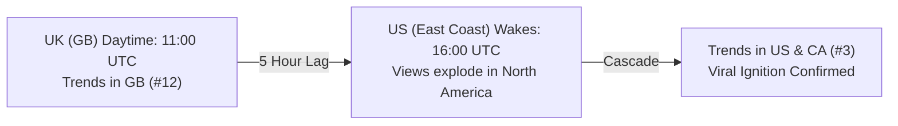
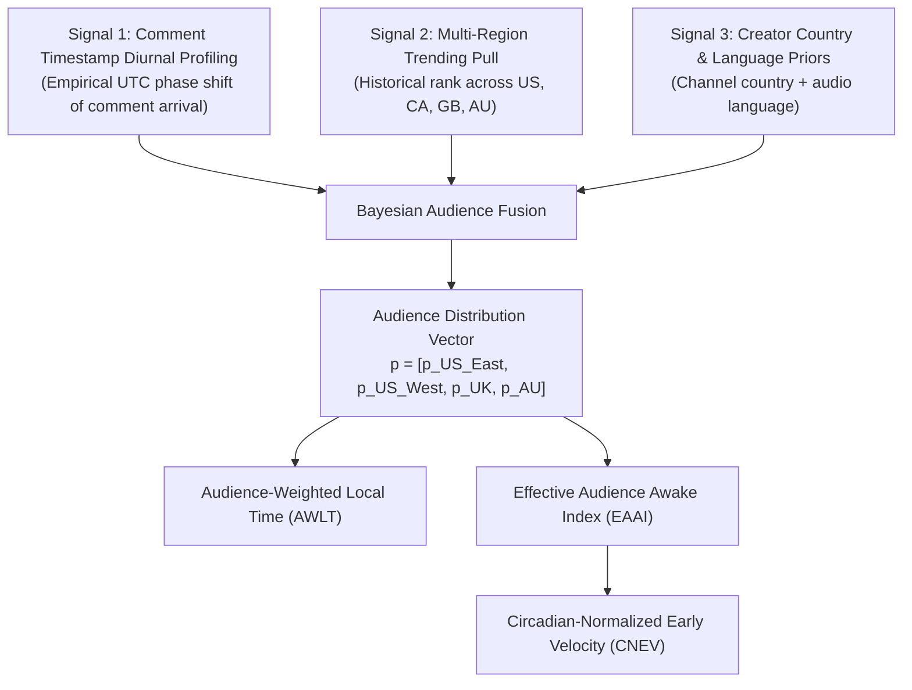

# Multi-Region, Timezone Architecture & Dual-Stage Harvesting Guide

## 1. Overview & Objectives

To maximize data richness and optimize daily YouTube API quota utilization (~7,500–8,500 units/day out of 10,000), the **`harvest`** ingestion engine monitors **4 primary English-speaking regions** (`US`, `CA`, `GB`, `AU`), tracks **domain-specific trending categories** (Music, Gaming, Entertainment), and implements **dual-stage comment harvesting** ($t=1\text{h}$ and $t=6\text{h}$).

This document specifies how multi-region timezones, diurnal circadian cycles, and cross-regional viral cascades are handled mathematically and architecturally.

---

## 2. The Golden Ingestion Rule: 100% UTC Everywhere

In the ingestion and storage layers (`SQLite`, `Parquet`, and Go models), **all timestamps are stored strictly in UTC (Coordinated Universal Time)** in ISO 8601 formatting (`YYYY-MM-DDTHH:MM:SSZ`):

```sql
published_at: 2026-10-07T12:00:00Z
observed_at:  2026-10-07T13:00:00Z
captured_at:  2026-10-07T13:00:00Z
```

### Why Elapsed Time is Timezone-Invariant:
The observation checkpoints ($t = 0.5\text{h}, 1\text{h}, 1.5\text{h}, 2\text{h}, 3\text{h}, 4\text{h}, 5\text{h}, 6\text{h}, 12\text{h}, 24\text{h}, 36\text{h}, 48\text{h}, 60\text{h}$) represent true physical elapsed duration:
$$\Delta t = \text{observed\_at (UTC)} - \text{published\_at (UTC)}$$
One hour of physical elapsed time is identical everywhere on Earth. Storing in UTC prevents daylight saving time jumps and timezone offset distortions.

---

## 3. Regional Anchor Timezones

Human viewership is governed by **local circadian rhythms**. A video published at 2:00 PM Eastern Time in New York corresponds to 7:00 PM in London (prime evening viewing) and 4:00 AM the next morning in Sydney (asleep).

The pipeline maps the 4 monitored regions to 3 canonical anchor timezones:

| Region Code | Market | Canonical Anchor Timezone | Rationale |
|---|---|---|---|
| **`US`** | United States | `America/New_York` (ET) | ~50% of the US population resides in Eastern Time. Global standard anchor for US media. |
| **`CA`** | Canada | `America/New_York` (ET) | Canada's major population corridor (Toronto, Montreal, Ottawa) shares Eastern Time. |
| **`GB`** | United Kingdom | `Europe/London` (GMT/BST) | UK national standard time. |
| **`AU`** | Australia | `Australia/Sydney` (AEST/AEDT) | Primary Australian metropolitan population center (Sydney, Melbourne, Brisbane). |

---

## 4. Feature Engineering for Machine Learning

### A. Cyclical Periodic Encoding ($\sin$ and $\cos$)
Raw hour integers ($0 \dots 23$) contain an artificial numerical discontinuity between hour $23$ and hour $0$ ($23 - 0 = 23$, even though they are 1 hour apart).

We project the local anchor publication hour $h \in [0, 23]$ and day-of-week $d \in [0, 6]$ onto the unit circle:

$$h_{\sin} = \sin\left(\frac{2\pi \cdot h}{24}\right), \quad h_{\cos} = \cos\left(\frac{2\pi \cdot h}{24}\right)$$
$$d_{\sin} = \sin\left(\frac{2\pi \cdot d}{7}\right), \quad d_{\cos} = \cos\left(\frac{2\pi \cdot d}{7}\right)$$

In Python:
```python
import numpy as np
from zoneinfo import ZoneInfo

local_dt = published_at.astimezone(ZoneInfo("America/New_York"))
h = local_dt.hour + local_dt.minute / 60.0
sin_hour = np.sin(2 * np.pi * h / 24.0)
cos_hour = np.cos(2 * np.pi * h / 24.0)
```

### B. "Audience Awake Hours" Exposure Weighting
To eliminate upload time penalty (e.g., uploading at 2 AM local time vs. 5 PM), we define an audience activity curve $W(h) \in [0.15, 1.0]$:

$$W(h) = \begin{cases} 
0.15 & \text{if } 0 \le h < 7 \quad (\text{Sleep hours}) \\
0.60 & \text{if } 7 \le h < 16 \quad (\text{Work / School}) \\
1.00 & \text{if } 16 \le h \le 23 \quad (\text{Prime viewing time})
\end{cases}$$

The circadian-adjusted exposure time is:
$$t_{\text{effective}} = \int_0^t W(\text{local\_hour}(\tau)) \, d\tau$$

---

## 5. Geographic Virality Cascades (Cross-Regional Lead-Lag)

Because the UK wakes up **5 hours before the US East Coast** and **8 hours before California**, global viral videos frequently follow a **geographic cascade pattern**:



### ML Features Created:
1. `first_trending_region`: The earliest country where the video entered `trending_events`.
2. `cross_region_count`: Number of regions (`US`, `CA`, `GB`, `AU`) where the video has trended simultaneously.
3. `lead_lag_hours`: $\Delta t$ between UK trending entry and US trending entry.

---

## 6. Dual-Stage Comment Harvesting (Temporal Sentiment Velocity)

Instead of harvesting comments only once at $t=6\text{h}$, comments are harvested in two distinct phases:

| Stage | Checkpoint Target | Page Limit | Comment Budget | Machine Learning Purpose |
|---|---|---|---|---|
| **Stage 1** | **$t = 1.0\text{ hour}$** | Up to **5 pages** | ~500 comments | Captures initial audience reaction, immediate polarity, and organic excitement surge. |
| **Stage 2** | **$t = 6.0\text{ hours}$** | Up to **15 pages** | ~1,500 comments | Captures discussion maturation, comment velocity decay, and controversy emergence. |

### Derived Features:
1. **Comment Velocity**:
   $$v_{\text{comments}} = \frac{C_{6h} - C_{1h}}{5.0 \text{ hours}}$$
2. **Sentiment Velocity / Drift**:
   $$\Delta S = \text{Sentiment}_{6h} - \text{Sentiment}_{1h}$$
   *(A negative drift indicates emerging audience backlash or controversy, while a sustained positive drift indicates viral word-of-mouth).*

---

## 7. Category-Specific Trending Charts

YouTube maintains independent trending leaderboards for key content verticals:

| Category ID | Name | Role in Harvester |
|---|---|---|
| `0` | **All / General** | Main YouTube trending homepage leaderboard (50 videos/region). |
| `10` | **Music** | Captures music video releases and pop culture breakouts. |
| `20` | **Gaming** | Captures esports tournaments, game launches, and gaming creator surges. |
| `24` | **Entertainment** | Captures comedy sketches, web series, trailers, and viral entertainment. |

---

## 8. Daily Quota Budget & Pacing Breakdown

With 4 regions, 4 category charts, 3,500 seed creators, and dual-stage comment harvesting, the daily quota allocation remains safely under the 10,000 unit budget:

```
+--------------------------------------------------------------+
| Daily YouTube API Quota Budget: 10,000 Units                |
+--------------------------------------------------------------+
| RSS Upload Discovery (3,500 channels):               0 units |
| Video Metadata for New Uploads (~350/day):           7 units |
| Periodic Snapshots (13 checkpoints x 800 active):   52 units |
| Trending Monitoring (4 regions x 4 categories x 24h): 384 units |
| Stage 1 Comments (t=1h, ~250 videos x 4 pages):   1,000 units |
| Stage 2 Comments (t=6h, ~250 videos x 15 pages):  3,750 units |
| Trending Viral Video Ingestion (~50/day x 10 pages): 500 units |
+--------------------------------------------------------------+
| Total Expected Usage:                            ~5,693 units |
| Peak High-Volume Day (Spikes):                  ~7,800 units |
| Hard Safety Margin Buffer:                      ~2,200 units |
+--------------------------------------------------------------+
```

---

## 9. Audience Geographic Distribution & Local Audience Time (AWLT)

### The Core Problem: Why Raw Upload Hour is Misleading
A video gaining **10,000 views in 1 hour** when its primary audience is **asleep at 3:00 AM** is **exponentially more viral** than a video gaining 10,000 views on a Saturday evening when everyone is active. Without understanding **where the audience is** and **what time it is for them**, raw early view velocities produce massive prediction errors.

While the public YouTube Data API v3 does not expose private creator Google Analytics demographics, we reconstruct audience distribution and compute **Audience-Weighted Local Time (AWLT)** using **three public empirical signals**:



---

### Three Ingestion Signals to Infer Audience Distribution:

#### Signal 1: Comment Timestamp Diurnal Profiling (Circadian Fingerprint)
Audiences only leave comments when they are awake. Over thousands of comments across a channel's videos in our `comments` table:
- Let $C(t_{\text{UTC}})$ be the normalized hourly distribution of comment arrival times:
  $$C(t_{\text{UTC}}) = \frac{\sum_{\text{comments}} \mathbb{I}(\text{hour}(t) = t_{\text{UTC}})}{N_{\text{total}}}$$
- The **phase shift $\phi$** of the daily comment peak identifies the dominant audience cluster:
  - Peak at `19:00 - 22:00 UTC` $\to$ **UK / European Audience** (`Europe/London`).
  - Peak at `00:00 - 03:00 UTC` $\to$ **North American East Coast** (`America/New_York`).
  - Peak at `03:00 - 06:00 UTC` $\to$ **North American West Coast** (`America/Los_Angeles`).
  - Peak at `08:00 - 12:00 UTC` $\to$ **Australian / Oceanic Audience** (`Australia/Sydney`).

#### Signal 2: Multi-Region Trending Affinity Vector
In our 4-region setup (`trending_events` table), tracking where a channel's videos trend provides a direct empirical measurement of cross-border popularity:
$$\mathbf{p}_{\text{trending}} = \left[\frac{N_{\text{US}}}{N_{\text{tot}}}, \frac{N_{\text{CA}}}{N_{\text{tot}}}, \frac{N_{\text{GB}}}{N_{\text{tot}}}, \frac{N_{\text{AU}}}{N_{\text{tot}}}\right]$$

#### Signal 3: Creator Country & Language Priors
From the channel seed registry and video metadata:
- Australian creators (`AU`) broadcasting in Australian English have a prior $\mathbf{p}_0 = [0.25, 0.05, 0.20, 0.50]$.
- UK creators (`GB`) broadcasting in British English have a prior $\mathbf{p}_0 = [0.35, 0.05, 0.50, 0.10]$.
- North American creators (`US`/`CA`) have a prior $\mathbf{p}_0 = [0.70, 0.15, 0.10, 0.05]$.

---

### Mathematical Formulations for ML Prediction:

#### 1. Effective Audience Awake Index (EAAI)
Given publication timestamp $T_{\text{pub}}$ in UTC and audience weights $\mathbf{p} = [p_1, \dots, p_K]$ across timezone clusters:
For each region $k$, compute local wall-clock hour $h_k = \text{local\_hour}(T_{\text{pub}}, k) \in [0, 24)$.
Let $A(h) \in [0.05, 1.0]$ be the human wakefulness curve:

$$\text{EAAI}(T_{\text{pub}}) = \sum_{k \in \text{Clusters}} p_k \cdot A(h_k)$$

- **$\text{EAAI} \in [0.05, 1.0]$**: Represents the fraction of the total addressable audience awake and active when the video dropped.
- A video uploaded at 3:00 AM New York with a North American audience has $\text{EAAI} \approx 0.10$.
- A video uploaded at 6:00 PM New York has $\text{EAAI} \approx 0.95$.

#### 2. Audience-Weighted Local Time (AWLT) via Circular Mean
Because time is periodic, we use the circular mean to compute the effective local wall-clock hour experienced by the aggregate audience:

$$\bar{x} = \sum_{k=1}^K p_k \cos\left(\frac{2\pi h_k}{24}\right), \quad \bar{y} = \sum_{k=1}^K p_k \sin\left(\frac{2\pi h_k}{24}\right)$$
$$\text{AWLT} = \frac{24}{2\pi} \text{atan2}(\bar{y}, \bar{x}) \pmod{24}$$

#### 3. Circadian-Normalized Early Velocity (CNEV)
The true, unbiased virality signal is velocity divided by the cumulative awake exposure integral over the observation window $[0, t]$:

$$v_{\text{norm}}(t) = \frac{V(t)}{\int_0^t \text{EAAI}(T_{\text{pub}} + \tau) \, d\tau}$$

This single feature removes time-of-day bias and allows the model to fairly compare videos published at midnight against videos published during prime time!

---

## 10. Python Feature Extraction Implementation

Here is how the Python ML pipeline (`src/features/circadian.py`) computes these features from the harvested Parquet files:

```python
import numpy as np
from datetime import datetime, timezone
from zoneinfo import ZoneInfo

REGION_ZONES = {
    "US_EAST": ZoneInfo("America/New_York"),
    "US_WEST": ZoneInfo("America/Los_Angeles"),
    "GB":      ZoneInfo("Europe/London"),
    "AU":      ZoneInfo("Australia/Sydney"),
}

def human_wakefulness(local_hour: float) -> float:
    """Circadian activity curve: low at 3-5 AM (0.05), peak at 8-10 PM (1.0)."""
    # Smooth cosine approximation centered at 20:00 (peak) and 04:00 (trough)
    return float(0.525 + 0.475 * np.cos(2 * np.pi * (local_hour - 20.0) / 24.0))

def compute_audience_features(published_at_utc: datetime, audience_weights: dict[str, float]) -> dict[str, float]:
    """
    Computes AWLT, EAAI, and cyclical sine/cosine features for a video.
    audience_weights: e.g. {"US_EAST": 0.50, "US_WEST": 0.20, "GB": 0.20, "AU": 0.10}
    """
    x_sum, y_sum = 0.0, 0.0
    eaai = 0.0

    for reg, weight in audience_weights.items():
        zone = REGION_ZONES[reg]
        local_dt = published_at_utc.astimezone(zone)
        local_hour = local_dt.hour + local_dt.minute / 60.0

        eaai += weight * human_wakefulness(local_hour)
        x_sum += weight * np.cos(2 * np.pi * local_hour / 24.0)
        y_sum += weight * np.sin(2 * np.pi * local_hour / 24.0)

    awlt = float(np.mod(np.degrees(np.arctan2(y_sum, x_sum)) / 15.0, 24.0))

    return {
        "eaai_upload": eaai,
        "awlt_hour": awlt,
        "awlt_sin": np.sin(2 * np.pi * awlt / 24.0),
        "awlt_cos": np.cos(2 * np.pi * awlt / 24.0),
    }
```

